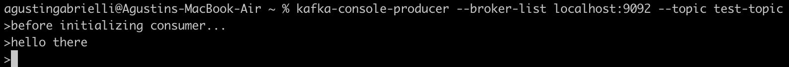

# lab4-kafka

# Steps that were followed

1) I installed Apache Kafka on my local machine

2) I started the ZooKeeper service
```zookeeper-server-start /opt/homebrew/etc/kafka/zookeeper.properties```


3) I started the Kafka broker service with the default configuration

```kafka-server-start /opt/homebrew/etc/kafka/server.properties```


Now that we have launched all services successfully, we have the basic Kafka environment running and ready to use.

4) I created a new topic called “test-topic” with a single partition and a replication factor of 1

```kafka-topics --create --bootstrap-server localhost:9092 --replication-factor 1 --partitions 1 --topic test-topic```


We can even describe the topic to check the info

```kafka-topics --describe --bootstrap-server localhost:9092 --topic test-topic```


5) We can even launch a producer and consumer within the console
Launching a producer that publishes to test-topic

```kafka-console-producer --broker-list localhost:9092 --topic test-topic```



### Launching a consumer that subscribes to test-topic

```kafka-console-consumer --bootstrap-server localhost:9092 --topic test-topic --from-beginning```

Notice that the events published by the producer arrive correctly at the consumer.


6) I implemented a Kafka producer 
in Python that publishes messages (JSONs with random numbers in it) to the topic at intervals of 1 second

7) I implemented a Kafka consumer 
in Python that prints the messages that receives from the topic

8) When launching both, we can see them in action:

### Producer:


### Consumer:


And even the other consumer we had created in the console received them…

Of course we can launch as many producers and consumers as we want.


